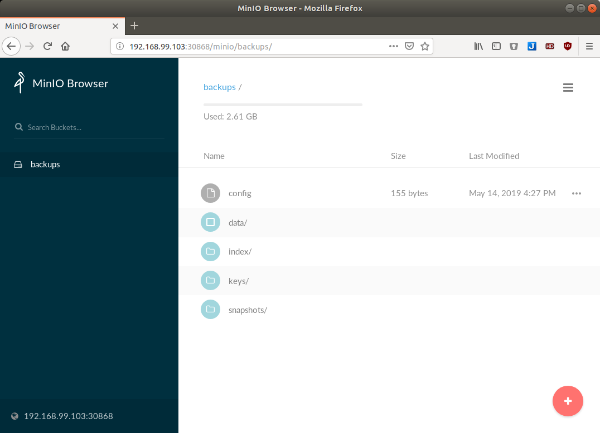

# Getting Started

- [Getting Started](#getting-started)
  - [Prerequisites](#prerequisites)
    - [Install K8up](#install-k8up)
    - [Install MinIO](#install-minio)
    - [Create a PersistentVolumenClaim Resource](#create-a-persistentvolumenclaim-resource)
    - [Create Backup Credentials](#create-backup-credentials)
  - [Set Up a Backup Schedule](#set-up-a-backup-schedule)
  - [Checking the Status of Backup Jobs](#checking-the-status-of-backup-jobs)
  - [Application-Aware Backups](#application-aware-backups)
  - [What is Next?](#what-is-next)

This document provides a quick introduction to K8up, how it works and how to use it.

## Prerequisites

This section provides information about the minimum requirements for testing K8up on Minikube.

Before starting please make sure Minikube is installed and started, and that `helm` is installed and properly initialized in your Minikube.

### Install K8up

The most convenient way to install K8up is with [helm](https://helm.sh/). First add the `appuio` repository:

```bash
helm repo add appuio https://charts.appuio.ch
helm repo update
```
Then install K8up itself:

```bash
helm install appuio/k8up
```

### Install MinIO

[MinIO](https://min.io/) is a distributed object storage service for high performance, high scale data infrastructures. It is a drop in replacement for AWS S3 in your own environment. We are going to install it to simulate a remote S3 bucket where our backups are going to be stored:

```bash
kubectl create -f https://github.com/minio/minio/blob/master/docs/orchestration/kubernetes/minio-standalone-pvc.yaml?raw=true

kubectl create -f https://github.com/minio/minio/blob/master/docs/orchestration/kubernetes/minio-standalone-deployment.yaml?raw=true

kubectl create -f https://github.com/minio/minio/blob/master/docs/orchestration/kubernetes/minio-standalone-service.yaml?raw=true
```

After a few minutes you should be able to see your MinIO installation on the browser using `minikube service minio-service`. The default Minio installation uses the access key `minio` and secret key `minio123`.

### Create a PersistentVolumenClaim Resource

This will be the resource backed up by K8up:

```yaml
kind: PersistentVolumeClaim
apiVersion: v1
metadata:
  name: apvc
spec:
  accessModes:
    - ReadWriteMany
  resources:
    requests:
      storage: 1Gi
```

Save the YAML above in a file named `pvc.yml` and use the `kubectl apply -f pvc.yml` command to deploy this configuration to your cluster.

### Create Backup Credentials

Create the secret credentials for the backup repository:

```yaml
apiVersion: v1
kind: Secret
metadata:
  name: backup-credentials
  namespace: default
type: Opaque
data:
  username: bWluaW8=
  password: bWluaW8xMjM=

---

apiVersion: v1
kind: Secret
metadata:
  name: backup-repo
  namespace: default
type: Opaque
data:
  password: cEBzc3cwcmQ=
```

Save the YAML above in a file named `secrets.yml` and use the `kubectl apply -f secrets.yml` command to deploy this configuration to your cluster.

The values of the secrets need to be encoded in Base64 encoding. The default MinIO installation uses the access key `minio` and secret key `minio123`, which are encoded as Base64 in the `backup-credentials` Secret definition.

You can easily convert a string to Base64 format in a terminal session as follows:

```bash
echo -n "p@ssw0rd" | base64
```

!!! Warning
    Please store that password somewhere safe. This is the encryption password for Restic. Without it you will lose access to the backup permanently.


## Set Up a Backup Schedule

The custom Schedule object below defines the frequency, destination and secrets required to backup items in your namespace:

```yaml
apiVersion: backup.appuio.ch/v1alpha1
kind: Schedule
metadata:
  name: schedule-test
spec:
  backend:
    s3:
      endpoint: http://minio-service:9000
      bucket: backups
      accessKeyIDSecretRef:
        name: backup-credentials
        key: username
      secretAccessKeySecretRef:
        name: backup-credentials
        key: password
    repoPasswordSecretRef:
      name: backup-repo
      key: password
  archive:
    schedule: '0 0 1 * *'
    restoreMethod:
      s3:
        endpoint: http://minio-service:9000
        bucket: archive
        accessKeyIDSecretRef:
          name: backup-credentials
          key: username
        secretAccessKeySecretRef:
          name: backup-credentials
          key: password
  backup:
    schedule: '*/5 * * * *'
    keepJobs: 4
    promURL: http://minio-service:9000
  check:
    schedule: '0 1 * * 1'
    promURL: http://minio-service:9000
  prune:
    schedule: '0 1 * * 0'
    retention:
      keepLast: 5
      keepDaily: 14
```

Save the YAML above in a file named `backup.yml` and use the `kubectl apply -f backup.yml` command to deploy this configuration to your cluster.

The file above will instruct the operator to do backups every 5 minutes, as well as monthly prune and check jobs for repository maintenance. It will also archive the latest snapshots to the `archive` bucket once each week.

After 5 minutes of running this demo, you should be able to run the command `minikube service minio-service` and see the backups in a `backups` bucket inside the web administration. Remember that the default access and secret keys are `minio` and `minio123` respectively.



Feel free to adjust the frequencies to your liking. To help you with the crontab syntax, we recommend to check [crontab.guru](https://crontab.guru).

!!! Note
    * You can always check the state and configuration of your backup by using `kubectl describe schedule`
    * By default all PVCs are stored in backup. By adding the annotation `appuio.ch/backup=false` to a PVC object it will get excluded from backup.

## Checking the Status of Backup Jobs

Every time a job starts, it creates a separate pod in your namespace. You can see them using `kubectl pods`. You can then use the usual `kubectl logs <POD NAME>` command to troubleshoot a failed backup job.

## Application-Aware Backups

It is possible to define annotations on pods with backup commands. These backup commands should create an application-aware backup and stream it to stdout.

Define an annotation on pod:

```yaml
<SNIP>
template:
  metadata:
    labels:
      app: mariadb
    annotations:
      appuio.ch/backupcommand: mysqldump -uroot -psecure --all-databases
<SNIP>
```

With this annotation the operator will trigger that command inside the the container and capture the stdout to a backup.

Tested with:

* MariaDB
* MongoDB
* tar to stdout

But it should work with any command that has the ability to output the backup to stdout.

## What is Next?

For advanced configuration of the operator please see [Advanced config](advanced-config.md).
